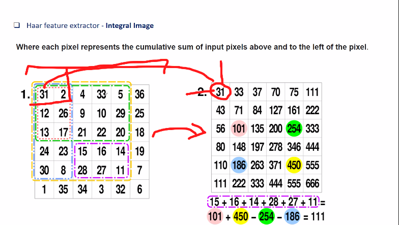
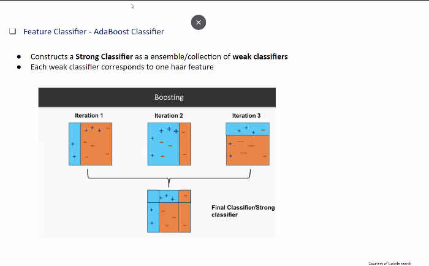
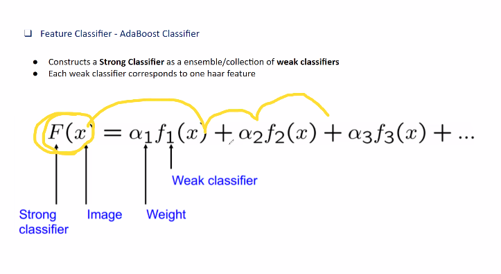

# Visual Inference - I

Being able to understand what is present in an image and where it is present.

- When moving objects into the feature space, the different classes should be seperable. Not relly linearly seperable
	- Maximal interclass variation
	- Minimal intraclass variation

### Traditional approaches of feature extraction

- Haar wavelets : Haar feature extractor
	- A sequence of scaled, square shaped signals that form an orthonormal basis
	- 
	- 
	- It is a wave of unit duration
	- To extend it to larger duration there are two constraints
		- The area under the curve should be zero
		- Total area under the squares should be 1
		- Hence, if the frequency is increased, amplitude will decrease
	- n is modulating the size of wavelength and magnitude. 
	- k defines where the wavelet should sit. At 0 or at a shift
	- 
		- This shows the dot product of two wavelets
		-
	- There are basic har wavelets and also come up with different types of haar wavelets which fits different types of data
	- The haar space may not represent all the data in a seperable way. Hence, CNN helps in identifying different space 
	- The idea of integral Image :Reducing computation so that each pixel will have to be accessed only one. 
	- 
	- Each pixel is transformed by adding the previuous value on left and top in the transformed space
	- The bottom left value will give the sum of all elements in the box as marked. 
	- For any region, ( marked in colors in transformed image), sum of diagobal - sum of anti diagonal elelembts will give the same result as addin gall elements in the space in the original domain.
	- This will bring down the computational complexity from quadratic to linear time
	- 
		- In this we do a large number of haar calculations and if the result is above a threshold, we keep that part of the image. Else we discard them
		- Setting this threshold is tricky. It starts with a low threshold as as it progresses, the threshold will keep on increasing
		- AT first stage, the threshold is vbery low. So it removes very bad pixels which are not faces. 
		- At each stage, we increase the threshold, which allows us to have a weak class at each stage but after a couple of stages. 

- Adaboost Classifier. It shows how few weak classifiers can create a string classifier
- 
	- The alpha in each stage represnts the accuracy of the classifer. If the classifier has low accuracy then the value of alpha will be low. Else it would be high. 
	- x is a feature of an image
	- The first classifier would classify some points,
	- It would then identify which points were misclassified and the next classifier tries to classify the misclassified points
	- This process will be repreated with misclassifiers
	- 
---
**
If the basic har set is complete, then why do you need the extended set?**

