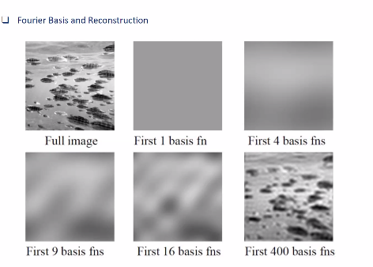
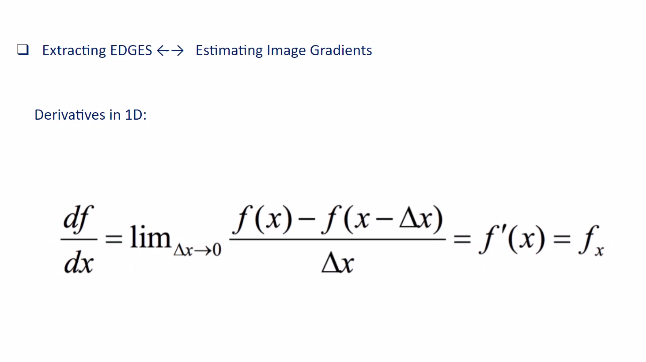
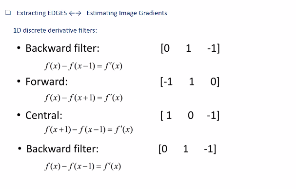

## Human Cognition in images

- Frequency is the speed at which the underlying signals of an image change. 
- 
- In the above picture the frequency is very high. Hence we are able to see the image clearly. 
- If we zoom in the frequency will be loss and image will be not clear
- The more slaient features of visual content is held in high frequency components

### Properties of Fourier Transform

- Linear property of linearity
- F[ax(t) + by(t)]= aF[x(t)]+bF[y(t)]
- Fourier transform of a real signal issymmetric about the origin
- Lossy transformation : The information is lost during transformation
- Lossless transformation : Information is not lost during the transformation

- Convoltion can be represented as multiplication in Frequency space

## Reading an FFT ( Fast Fourier transform)

- Handy because of the speed it provides
- 
- High (0,0) component means the image is very bright
- Centre is strong. Lot of low frequency in image. Information is concentrated in low frequency
- It contains large range of frequeency as seen in FFT
- With the first quadrant,we can reconstruct the entire forurier transform image as they are mirror images

- Nyquist sampling / ; Read

- When downsampling a signal, the frequency becomes double. This means that the frequency of n/4 becomes n/2. Which means we will loose the high frequency components.
- When a down sampled images are upsampled, a high frequency omponents are lost and images wil become blurry

#### Edges
- A location in image where a rapid change in image intensity happens
- First derivative of intensity function will show a peak
- High gradient suggests the presence of edges

## Designing kernel that perform derivative operation
- 
- Finding kernel from above equations : 
	- 
- x-axis filters finds vertical edges
- y-axis filters finds horizontal edges

- Decompose a filter help[s in reducing the number of calculations. In above case from 9 to 6
- This helps to avoid redundant computations

Reference : 
https://www.youtube.com/watch?v=oACegp4iGi0
https://www.youtube.com/watch?v=r18Gi8lSkfM&t=140s : Best
https://github.com/siddthesquid/ImageTransformer

