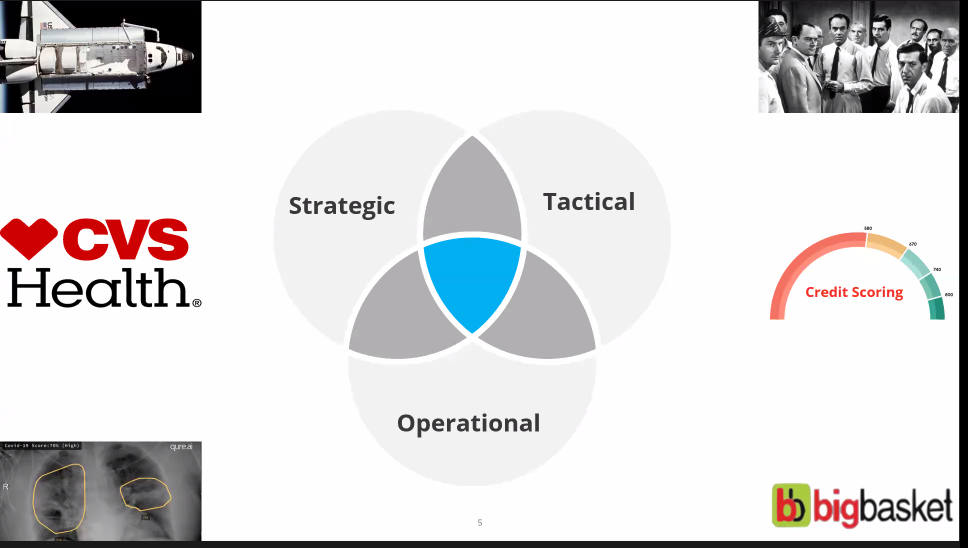

## Qure case study

##### Case studies so far

- In operational edcisions , models matter
- In strategic decisions, velocity matters

Xrays
- Pixel value range from 0 to 64000
- High details in pixels
- Classify pixel values into each levels ( Eg 0-100 in one layer , 100-200 in second layer etc )