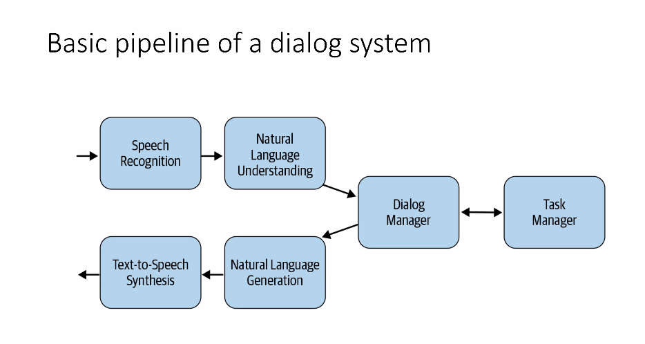
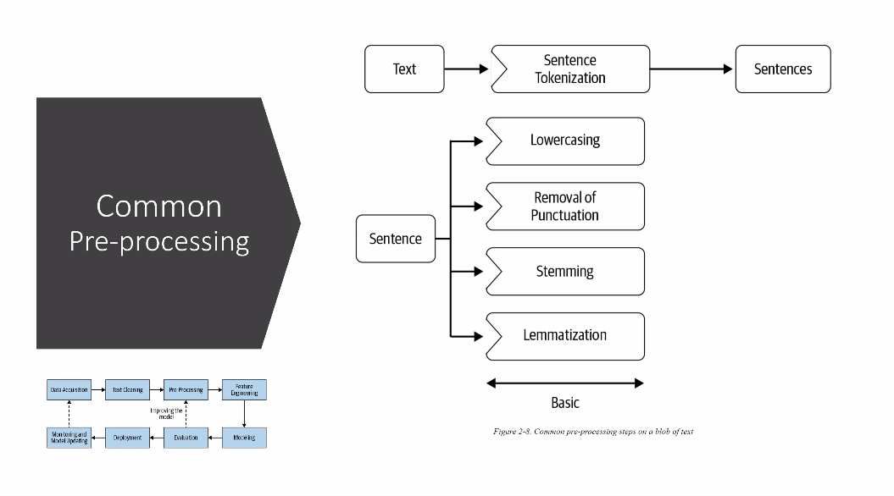
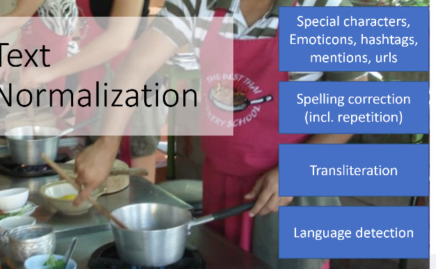
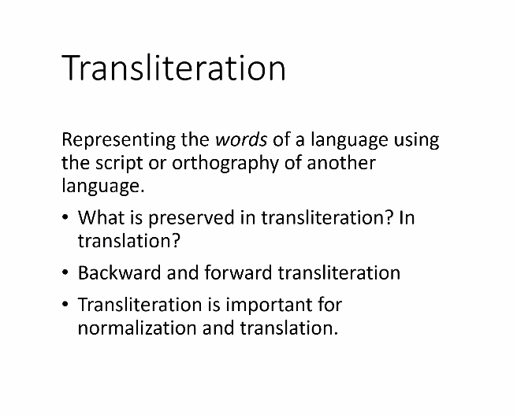

### How to break down a complex NLP task?

- AI started as rule bases systems and moved into data driven systems
- Deep Learning approaches are currently in progress

##### Eliza Chat bot
- A rule based chat bot
- Developed by Joseph Weizenbaum
- The **ELIZA Effect** ( A term used in HCI), is the tendency to unconciously assume computer behaviour analogous to human behaviour.
- Octopus test is an example of this

## Basic pipeline of a dialog system

- Speech Recognition: Word Error Rate : 
	- It has to be as low as possible. Error rate of uhmans in understanding fast speech is 6/7. Ie, in 100 words, 6 or 7 words can be understood wrong
	- certain languages have higher error rates
	- Is a problem because it requires lot of data which is not available for some languages. Accent plays an important role

- Natural Language Understanding : Converts into a structured representation

- Dialog manager : Takes input of NLU unit. Keeps track of all that was said before and decides what has to be said next

- Takes structured representation from Dialog manager and converts that into understandable form

- Text to speech : One problem with this is modulation, today.

### Natural language understanding : NLU 
- Identify the intend of the statement / input
- It is similar to a classification proble. Understanding what kind of intend the statement. 
-There is a lot of manually engineering work here. Eg : Identifying the entities

- Dialog state tracker : Information of how much details about a sentence has it understood. Each time the model understand the details about something, it changes state. There will also be a feedback loop, which will make sure all information is extracted. There can also be a final confirmation sharing all details extracted. 
- State machines are usually manually designed : Building a chatbot requires a lot of manual coding.
- Entity recognition, intend recognition, Speech recognition and speech synthesis in first architecture is ML based. All others are manually done. 
- Response generation :
	- Dialog manager keeps track of precise content. 
    - Most of the response generation are fixed responses. 
    - Templates with entities are used and these entities are flled based on information recieved
    Eg : I have understood that you want to order a ______ . 
    - Automatic generation : 
    Eg : Markov systems, or Deep learning based models

## Generic NLP Pipeline

- Lot of manual work is involved in Data Acquisition
- Text cleaner and Prepprocessing is really important , not only for creating models but also in accuracies

### Preprocessing

- Tokenization : Breaking down a sentence into words

	- Tokenization canot be done dmne simply by space or punctuation
    Eg 3.14 should not be split
    - Thai , Japanese does not have space.
    - Lets eat, grandma and Let's eat grandma :P
  
  	- Stemming and Lemmatization : 
    	- Morphology means stuctur of words
        - A word can be broken down into root word, 
        - Atemming involves cutting a word to get the root words
        
        - Stems may not produce valid words
        - Stemming was invented in context of english and suffix is very common in English
        - ###### Porter Stemmer : A better version created by Porter
        - Lemmatization gives the root word and stemmer just strips the word.
        

- In transliteration phonetics is preserved and in translation meaning is preserved
	
    
	- Backward transliteration requiers context. It is even difficult than forward transliteration
    