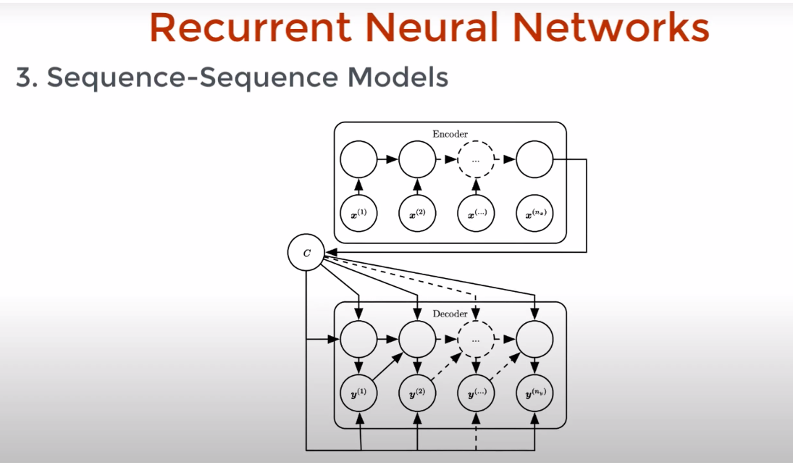
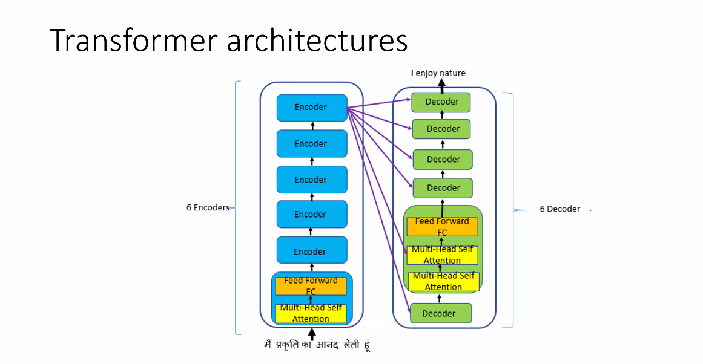
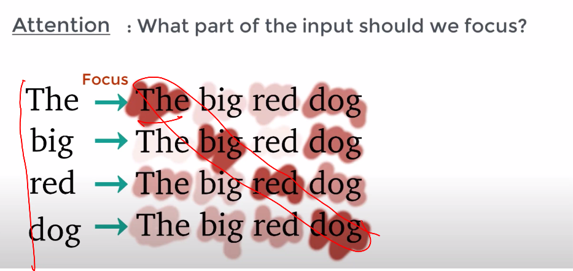

# Transformers and Contextual Word Embeddings

- How to represent sentences?
- We can use a bag of words model
	- Average of embeddings of all words in a sentence
	- Weighted average ( By giving more importance to words with meanings and low value to propositions etc)
	- 
	- Even if the sentence becomes A man bites a dog, the representation will be same. 
	- Hence we need sequence to be incorpoated into the above
	- RNN can be used to capture sequential information
	-  Eg : Sentence Generation
	-  Eg : Sentiment analysis. It is also slow
	- 
	- LSTM provide a highway for gradients so that hte problem of vanishing gradients is not there anymore
	- Problem of RNN with vanishing gradients starts occuring beyong 10 words
	- LSTM can go upto 100 words, but not beyond
	- LSTM cannot use parallel processing

### Transformer
- It is an encoder decoder pair on a high level
- 
- 
- In transforner each word has a vector
- The value of the vector would change based on it's position in sentence and it's contextual meaning
- All words are simaltaneously processed, hence can be processed simaltaneously

##### Architecture
- 
- Data will get encoded
- It will go ti Decoder
- Will be fed to Feed Forward layer which has same dimension as inupt
- More the number of encoders, it will take more time
- The output from last encoder, in this case is send to all decoders. It is optional. We can send it to few .
- It is also not necessary to select output from last encoder. Any type of connections can be made
- Details about encoder
	- 
	- Positional encoding has information about nearby words. It tells mopre information about the position of the words. Smaller role to play in context. 
	- 
	- Each element of positional encoding will correspond to a sine-wave of a different wavelength, hence each encoding will be unique 
	- For every position there will be a unique vector
	- Attention mechanism is the crux of encoder
	- In attention layer each vector looks at all the other vectors. It helps in giving context to the words.
	- 
		- The word itself is given importance which is obvious. But above picture shows how other words are given importance when a single word in being procesed.
		- 

Reference :: Towards Data Science - Simple explanation of transformers in NLP by Reny Khandelwal