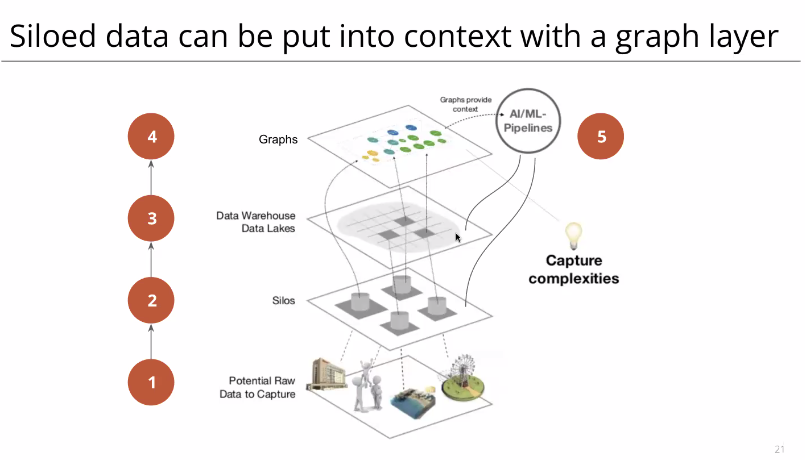
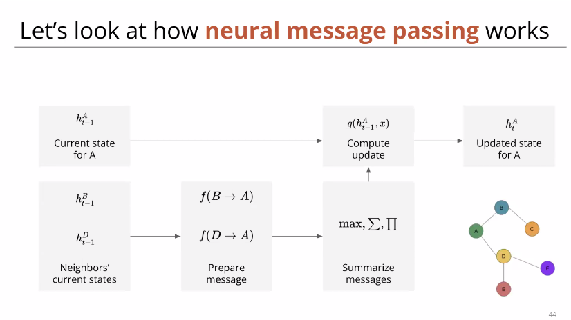
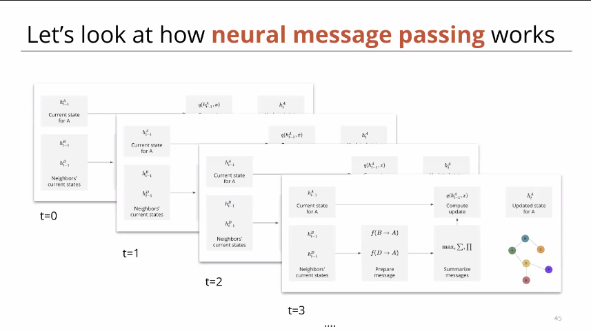
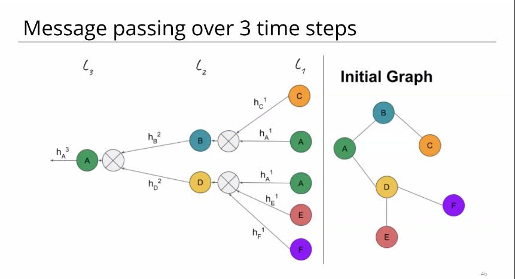
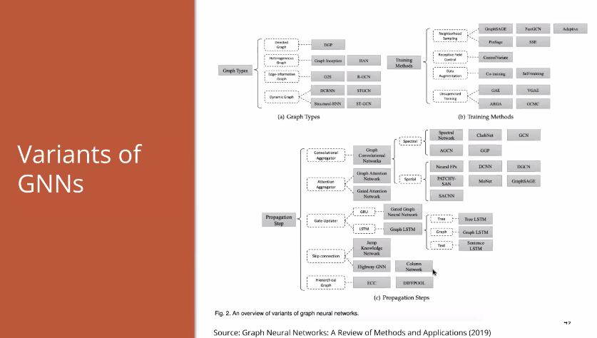

# Graphs and Graph Neural Network

### Content

- History and Theory of graphs
- benefits with graph modelling
- Use cases for graphs
- Graph Neural Network

### Types of graphs
- Directed graphs

This is the more general approach

- Undirected Graphs

This could be a subset of directed graphs

- Weighted graphs

Edges will have different weights

- Label Property Graphs

#### Advantages of Graphs
- High performance ( This varies from use case to use case )
- Easier visualization / Intuitive visualization
- Modelling flexibility
	- Extending a new connection / attribute is not as complex as a normal database

- Modelling flexibility
	- Extending a new connection / attribute is not as complex as a normal database

## Graph use cases
- Graph representations power a bunch of
## Graph use cases
- Graph representations power a bunch of algorithms
	- Pathfinding algorithms. ( Finding the shortest number of jumps )
		- Dijkstra algorithm - Shortest algorithm
		- Shortest Path
		- All pairs shortest paths
		- Single source shortest path
		- Minimum spanning tree
		- 

##### Questions that are answered by Centrality
- Betweeness
	- Which node has the most control over flow between nodes and groups?
- Degree
	- Number of connections?
- Closeness
	- Which node can most easily reach all other nodes in a graph or subgraph?
- PageRank 
	- Finding the most influential node

##### Community detection aims to find local clusters
- Measuring Algorithms
	- Triangle count
	- Clustering Coefficient etc

##### Fraud detection : Detect fraudulent activity through complex networks of relationships and entities

##### Feature engineering : Use graphs to construct additional features for AI/ML problems

##### Dimensioanlity reduction using graphs

### Graph Neural Networks
- Proven powerful in Biology and Chemistry
- Eg : Graph attention network to model amino acid spatial structures

# References
- PyG Library ( Build on top of PyTorch)- contains notebooks

- Spektral ( Build on top of tensorflow)
- Jraph 
- Oreily : 
- Stanford CS224W with Juke Leskovec ( 50 lectures 20 minutes each )

#### Try : 
- Converting a Relational DB into Graph DB
- neo4j : Swedish Graph database company
- Graph ML is a hot topic
- Cryptofxartibage
- bellman Ford algorithm
- Covid tracing with fraud algos-giithub.com/marcusze
- Knnowledge graph API by Google 
- TSNE for dimension
- grandcuster.github.io/umap explore

