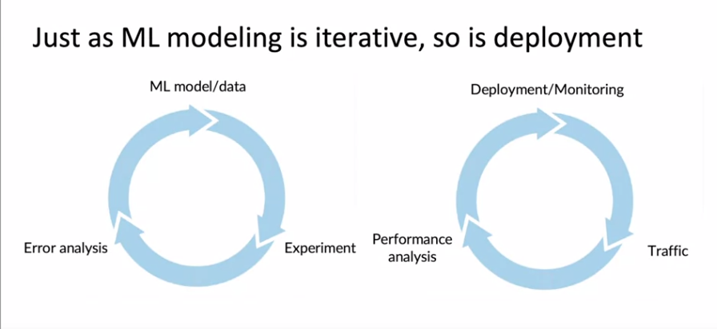

# Monitoring deployed ML systems

- Using dashboards
	- to monitor server loads
	- to monitor fraction of null outputs
	- to monitor fraction of missing input values
	- brainstorm things that can go wrong
	- brainstorm statistics that will detect problem
	Examples:
    - Software metrics
    	- Memory
    	- Compute
    	- Latency
    	- Thoughput
    	- Server Load
    - Input metrics
    	- metrics that measure as input changes
    		Eg :
            - Number / Percentage of values
            - Avergae image brightness
    - Output metrics
    	metrics that measure output changes
        - times model returns NULL
        - times use prefer human intervention

	
    It takes some time to converge to the right set of metrics to monitor
---

	Set thresholds in the monitoring dashboard to trigger alarms
    