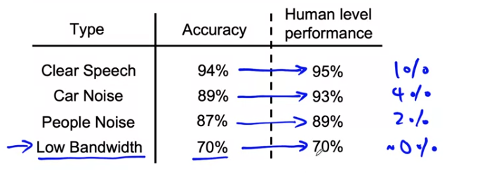

# Selecting and training a model

AI system = Code + Data

- Exploring the possibility of playing around with data to improve an AI system by keeping the model constant
- Altering the code can also help in improving the AI system
- Modifying hyperparameters also helps

### Challenges in Model development
Steps 
- Do well on the training data atleast
- Do well on dev/cv/test set
- Do well on business metrics / projects goals

### Common problems : Why low average error is not good enough?
- Check for performance of key slices of datasets
	- If a loanb approval system predicts well, and if it exhibits some kind of bias towards gener / ethnicity, it cannot be depoyed in production
    - If a recommender system only recommends products from retailers etc
- Rare classes in train and test datasets
	- Skewed classes

### Idea of baseline accuracy
It helps to indicate what might be possible

- Ask a human to label and find the human accuracy
- Compare model accuracy with human accuracy

- Establishing baseline can be different for unstructured data like images, audio, languages etc
- HLP ( human level performance ) might be very good on unstructured data and low on structured data like huge excel sheets
- Establishing baseline
	- HLP
    - Literature and similar project's accuracy
    - Quick and Dirty implementation using open source
    - Performance of older system

## Getting started

- Coming up with a model 
	- Understand what is possible from courses/blogs etc
	- Find open source implementations
	- A reasonable algorithm with good data will often outperform a complex algorithm with improper data
	- If the baseline is established, then take into consideration the deployment constraints like compute power etc
	- If not, understand the baseline
	- **Sanity check** for code and algorithm 
		- Try to overfit a small dataset before training on large one
		

#### Types of queries
- Informational : Apple pie recipe
- Transactional Query : Wirless data plan
- Navigational Query : To navigate to websites