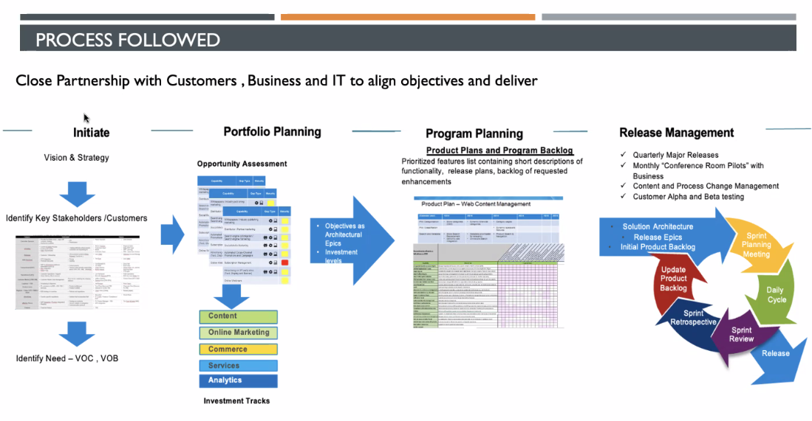

# Day in life of a product manager
	Can be an 
    - Outbound PM
    - Inbound PM
    - R&D PM
    - Enterprise PM etc
    The below details is for an Enterprise PM
    
- Manage Stakeholders
- Check industry Best Practices ( Gartner, Forrester, Standards org, Conferences), Competition Landscape, Market/Customer Survey
- Analysis
	- Data Mining and data analysis
	- Identify risks and issues
	- Identify Opportunities and improvements
	- Business impact analysys with other stakeholders for new scope - downstream/upstream
- Define
	- Strategy
	- Roadmap
	- Project Charter
	- MRD
	- BRD
	- Functional Spec Doc FSD
	- PRD
	- User Stories
	- Acceptance Criteria
- Working on funding approval with Sakeholders and other departments
- Work with other departments - Release Planning, Story grooming, Daily scrum meetings, Validation etc
- Communication - Post implementation a lot of work has to be done
	- Inbound/Outbound
	- Training documents
	- Release documents
	- Post release support strategy
	- Measure product performance post release. To verify that the goals have been met

## Process

- Priorotise the features needed from different stakeholders

Actions:
- Identify the frequency with which different activities have to be followed up with.
- Learn Agile Methodologies ( Terms and Devops usage)

