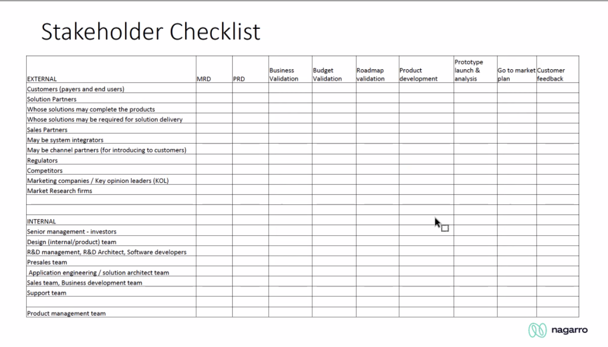
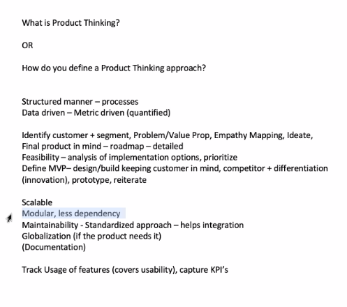

# Building Engaging Products

#### Stakeholder checklist

## Habit Loop

-> Cue -> Routine -> Reward -> Cue

# The Hook framework

The Hook Model
	- Starts with a trigger
	- It gets converted into actions
	- Gives a variable reward
	- User invests

This oncept applies to Business in a very large way
- Understand if Retention or frequency of use will add to revenue and work to increase the metric

## Quantitative Approach

- Funnel Analysis
- A/B testing
	- Show two different versions / features and see which let's us you achieve the final outcome. 
	- It can be tested on any number of people. Example : 1 million users given version A and anther million given version B
	www.wired.com/2012/04/ff-abtesting/
- Feature testing
	- Adding featues and putting a metric around it
	-  First tested in a sample to check the result

A new product willfirst have an incliing curve in terms of metrics, and then decline. Which is basically the lifecycle of a product. Becaew products or updates would replacethis. But incase of Internet era, a lot of products would have a cyclic phase as in below picture

# Note

 

###### Notes for interviews

- Modularity is very crucial
- Standardization and Maintenability is critical as well
- Technology space of the market / product is important () Market knowledge of the company is important )
- Even a small feature will affect the company as a whole. So it is important to understand the market of the company
- Share all details with an example
Questions : I believe the product manager does this. How is it done in your company?

What is your most important product? Walk through this

