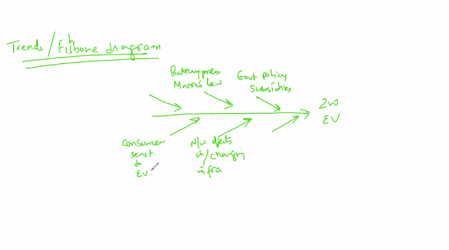

# Market Sizing

# Top Down Approach
- TAM, SAM and SOM
- Total Available Market
- Servicable Available Market ( Geographic )
- Servicable Obtainable Market ( Penetration )

# Bottom Up Approach <h5> ( Preferred Approach )</h5>

- Start from the targeted customers
- Identify how many of them are willing to buy
- Initially the data collect will be through interviews and then by pilots
- If bottom up says all customers need it, it will start to approximate a Top Down approach
- It tells you how to approach 
- Group the clusters into bigger clusters
- Another way to do market research can be to look for analogs, substitutesm other markets etc. 
- Categorization of similar solutions and try to find correlation with existing products. 
- Usage of trends or fishbone diagram
- 
- Market size is not static. It is a Point of View. So even if the market size is very small, look for opportunities to build it
- Think abouth the market from various different points by making use of the different approaches mentioned and triangulate then, it will give a better view of the market.
- Look at the market for a 3-5 year
- Formulate entry strategies