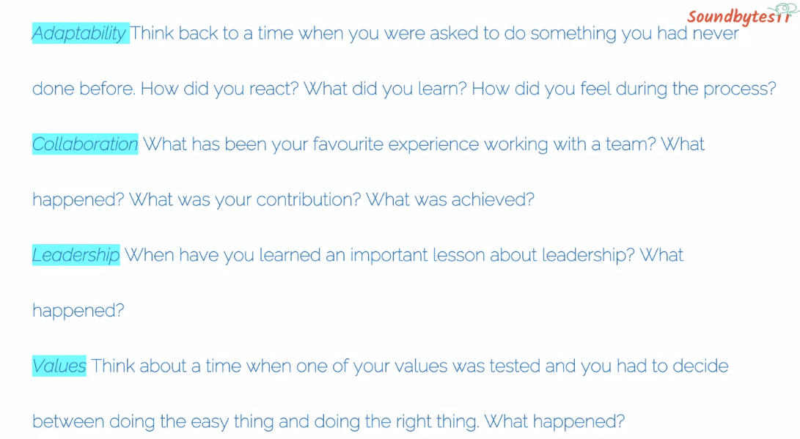

# Pitching and Interviews

- Constantly adjust your story to your audience
- Have different sized stories for different audiences at different times
- Tell your story for their partners too
- Use simple words and no jargons
- Draw analogies and shortcuts
- Four narrative templates
	- Think of industry story. Where does your company fit in
	- Think of customer story. How a customer would experience the product/ service. Share from customer perspective. Not how you solved it. 
	- Hero/Heroin. Why are you special and what is the difference that you are making. Pivots etc. Tailor journey based on insights
	- Use visuals. Show don't tell

## Interviews
- Be specific about colleges instances etc to make connections

- Without practise we may get stuck in the stories. Script out the story
- What does success look like in organuization? 
Working culture?
- Activities in daily job?
- Plan research and rthink about the questions. It could be something which was in thir website or linked in etc

## TIPS
- Why are you telling the story?
- How do you keep the story real?
- Keep it short?
- Have variety of stories. 

Reading :
The fuzzy and the techie : Scott Hartley 

### Learnings : 

3 learnings
2 likes 
1 will do
