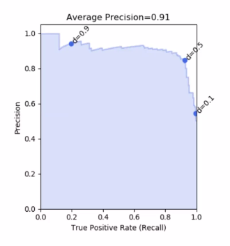

- Precision : What ever is predicted is corrected. 
	- Precision = TP / (TP+FN)
- Recall : Number of true objects that we can recall
	- Recall = TP / (TP + FN)

- If we reduce the threshold of classification, precision would drop and recall would increase
- 

### Local binary patterns

- Compare the neighboring pixels to central pixels
- Here, we capture the intensity change by using a binary representation
- 