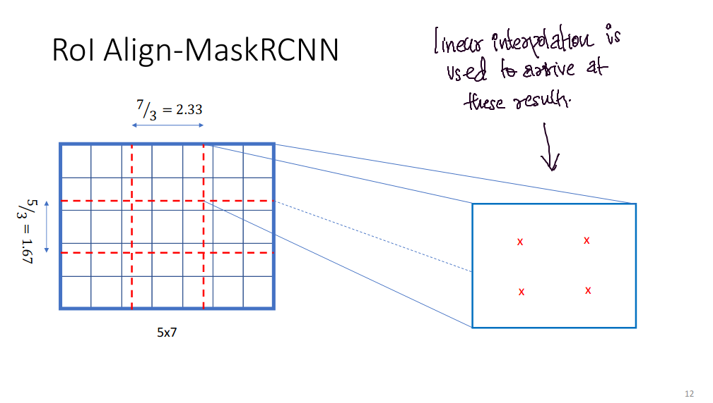

# Image segmentation

- ## Semantic Segmentation

	- A label over every pixel in the image
	- Can do a convolution over a selected area which is then moved around in the image. This process needs large number of convolutions which is very expensive. 
	- Dilated convolutions can help in reducing the number of operations
	

- However, the number of convolutions needed are still high. Hence we go for different approaches  
    ##### Approach 1
	-  Follow something like an encoder-decoder network. This can be done with or without convolution operations as a fully connected layer. But it can overfit the images. So we usually use convolutions over fully connected when it comes to images.
    
	
    	- This will produce the output image in the same size as the input. 
    - <a href='https://github.com/sandheepgopinath/Code-Repository/blob/main/Development/Artificial%20Intelligence/AutoEncoders/Deep_Autoencoder.ipynb'>Deep Autoencoder </a>

	- #### How do we do upsampling?
    	- Transposed convolution / Fractionally strided convolution
        

        
        
        <a href='https://towardsdatascience.com/types-of-convolutions-in-deep-learning-717013397f4d'> Types of convolutions </a>
        - Max unpooling
        
        
        - Remembers the location from where the maximum values were selected and restores values into that locations
        
        

  
- ## Unet 

- #### Dice Coefficient

	IOU = Intersection/Union
    	= TP / TP+FP+FN
---

	Dice Coefficeint = 2* Intersection / Union+Intersection
    				= 2*TP / TP+FN+FP+TP
                    
    Equivalent to F1 Score
    
       F1 Score = 1/(1/Precision + 1/Recall)
       Precision = TP / TP +FP
       Recall = TP / TP + FN
    =>        = 2TP / 2TP+FP+FN

	F1 score is a harmonic mean of Precision and Recall
	It will give the lowest value of Precision and Recall

    

- ## Instance level Segmentation with Mask RCNN

- Uses 2 stage detector as it has better recall

- ####Uses ROI Allign over ROI Pooling to make sure we do not loose any spatial information.
- 
Image credits : <a href ='https://www.crcv.ucf.edu/wp-content/uploads/2019/03/CAP6412_Spring2018_Mask-RCNN_New.pdf'> Muhammad Tayyab </a>

- ### Mobile Net
	- Depthwise Separable Convolution is used to reduce the model size and complexity. It is particularly useful for mobile and embedded vision applications.
	- Smaller model size: Fewer number of parameters
    - Smaller complexity: Fewer Multiplications and Additions (Multi-Adds)
	
	-Two parameters are introduced so that MobileNet can be tuned easily: Width Multiplier α and Resolution Multiplier ρ. And this is a paper published in arXiv 2017 [1] with more than 600 citations when I was writing this paper. (<a href='https://medium.com/u/aff72a0c1243?source=post_page-----a382df364b69-----------------------------------'>
Sik-Ho Tsang</a>@ Medium)

	- <a href='https://github.com/sandheepgopinath/Code-Repository/blob/main/Development/Computer-Vision/Facial%20Features/Face_mask_segmentation.ipynb'> Face Mask Segmentation using Unet </a>
