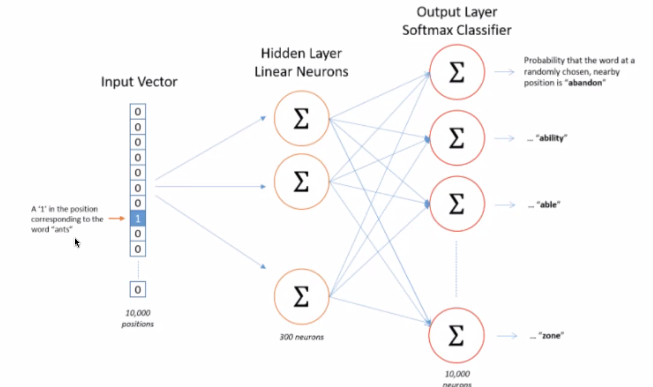

# Content

- Simple NLP
- Sequence Models and Embeddings
- ELMo and transformers
- HuggingFace

## Simple NLP

- Count vectorizer
	- Creating a sparse matrix with vocabulary and words present in a document
	- All the encoded words in Bag of words will be independednt of each other
	- If the ratio of number of samples / mean sample length is less than 1500, Big Grams works better. Else, Sequence model works better. 
	- Stemming lematization, n grams, pos tagging etc
	- Deep learning approaches the above process in the mdel architecture
	- For BOW model, there is no semantic meaning attached to the vocabulary. 
	- BOW also lacks context for term disambuiguation

- DL NLP
	- Sequence models process
		- Represent the input as sequences of integer indices ( One integer = One word )
		- Map each integer to a word embedding vector. It tells us about the semantic meaning of the words. Word embeddings helps to do Word vector math. 
		Eg : kind-man+woman=queen
	
		- Feed sequences of vectors into a model that cross-correlates features from adjacent vectors ( convnet, RNN , Transformer)

	- Word2Vec training 
		- Continous Bag Of Words : Use context words surrounding a particular word to predict  target word.
		- Skipgram : Predict surrounding words of an input word
	
    - Word2Vec Architecture
     

	- ELMo 
	
    
    
- Transformers

