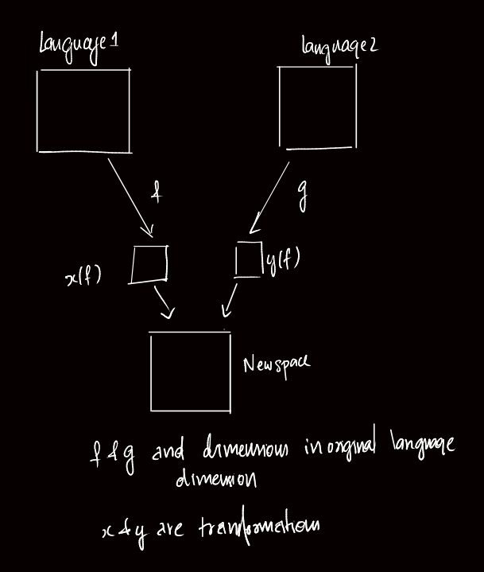
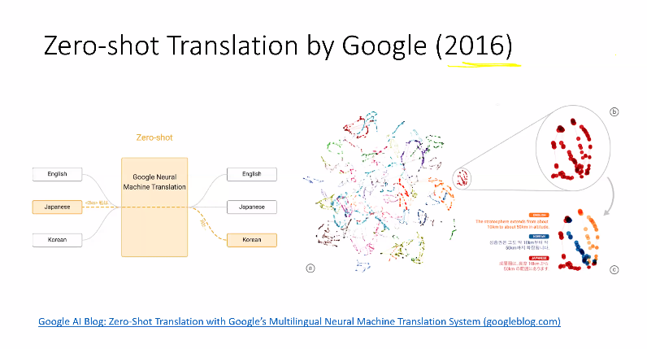
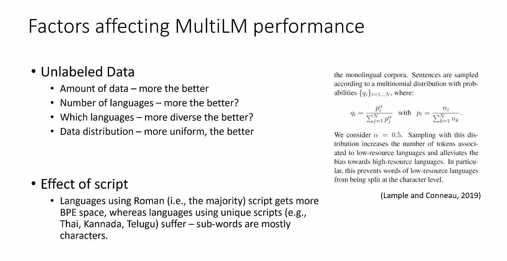

#### Can word embeddings be shared betwen languages?

- Cross lingual word embeddings
	- We create an intermediate stage where the words from all languages are moved into a new dimension.
	- A funtion maps the embeddings in both spaces to a common domain. 

##### Zero-shot translation by Google (2016)

- Google trained the model with English, Japanese and Korean fed into the same model. It was able to do translations for which the data was not given to the model . Hence Zero shot learning
- Here’s how it works. Let’s say we train a multilingual system with Japanese⇄English and Korean⇄English examples, shown by the solid blue lines in the animation. Our multilingual system, with the same size as a single GNMT system, shares its parameters to translate between these four different language pairs. This sharing enables the system to transfer the “translation knowledge” from one language pair to the others. This transfer learning and the need to translate between multiple languages forces the system to better use its modeling power.This inspired us to ask the following question: Can we translate between a language pair which the system has never seen before? An example of this would be translations between Korean and Japanese where Korean⇄Japanese examples were not shown to the system. Impressively, the answer is yes — it can generate reasonable Korean⇄Japanese translations, even though it has never been taught to do so. We call this “zero-shot” translation, shown by the yellow dotted lines in the animation. To the best of our knowledge, this is the first time this type of transfer learning has worked in Machine Translation. The success of the zero-shot translation raises another important question: Is the system learning a common representation in which sentences with the same meaning are represented in similar ways regardless of language — i.e. an “interlingua”? Using a 3-dimensional representation of internal network data, we were able to take a peek into the system as it translates a set of sentences between all possible pairs of the Japanese, Korean, and English languages.
- 
- ## [Zero-Shot Translation with Google’s Multilingual Neural Machine Translation System](http://ai.googleblog.com/2016/11/zero-shot-translation-with-googles.html "Zero-Shot Translation with Google’s Multilingual Neural Machine Translation System")

Tuesday, November 22, 2016

Posted by Mike Schuster (Google Brain Team), Melvin Johnson (Google Translate) and Nikhil Thorat (Google Brain Team)In the last 10 years, [Google Translate](https://translate.google.com/) has grown from supporting just a few languages to 103, translating over 140 billion words every day. To make this possible, we needed to build and maintain many different systems in order to translate between any two languages, incurring significant computational cost. With neural networks reforming many fields, we were convinced we could raise the translation quality further, but doing so would mean rethinking the technology behind Google Translate.In September, [we announced](https://research.googleblog.com/2016/09/a-neural-network-for-machine.html) that Google Translate is switching to a new system called [Google Neural Machine Translation (GNMT)](https://arxiv.org/abs/1609.08144), an end-to-end learning framework that learns from millions of examples, and provided significant improvements in translation quality. However, while switching to GNMT improved the quality for the languages we tested it on, scaling up to all the 103 supported languages presented a significant challenge.In “[Google’s Multilingual Neural Machine Translation System: Enabling Zero-Shot Translation](https://arxiv.org/abs/1611.04558)”, we address this challenge by extending our previous GNMT system, allowing for a single system to translate between multiple languages. Our proposed architecture requires no change in the base GNMT system, but instead uses an additional “token” at the beginning of the input sentence to specify the required target language to translate to. In addition to improving translation quality, our method also enables “Zero-Shot Translation” — translation between language pairs never seen explicitly by the system.

Here’s how it works. Let’s say we train a multilingual system with Japanese⇄English and Korean⇄English examples, shown by the solid blue lines in the animation. Our multilingual system, with the same size as a single GNMT system, shares its parameters to translate between these four different language pairs. This sharing enables the system to transfer the “translation knowledge” from one language pair to the others. This transfer learning and the need to translate between multiple languages forces the system to better use its modeling power.This inspired us to ask the following question: Can we translate between a language pair which the system has never seen before? An example of this would be translations between Korean and Japanese where Korean⇄Japanese examples were not shown to the system. Impressively, the answer is yes — it can generate reasonable Korean⇄Japanese translations, even though it has never been taught to do so. We call this “zero-shot” translation, shown by the yellow dotted lines in the animation. To the best of our knowledge, this is the first time this type of transfer learning has worked in Machine Translation. The success of the zero-shot translation raises another important question: Is the system learning a common representation in which sentences with the same meaning are represented in similar ways regardless of language — i.e. an “interlingua”? Using a 3-dimensional representation of internal network data, we were able to take a peek into the system as it translates a set of sentences between all possible pairs of the Japanese, Korean, and English languages.

Part (a) from the figure above shows an overall geometry of these translations. The points in this view are colored by the meaning; a sentence translated from English to Korean with the same meaning as a sentence translated from Japanese to English share the same color. From this view we can see distinct groupings of points, each with their own color. Part (b) zooms in to one of the groups, and part (c) colors by the source language. Within a single group, we see a sentence with the same meaning but from three different languages. This means the network must be encoding something about the semantics of the sentence rather than simply memorizing phrase-to-phrase translations. We interpret this as a sign of existence of an interlingua in the network. We show many more results and analyses in our paper, and hope that its findings are not only interesting for machine learning or machine translation researchers but also to linguists and others who are interested in how multiple languages can be processed by machines using a single system.Finally, the described Multilingual Google Neural Machine Translation system is running in production today for all [Google Translate](https://translate.google.com/) users. Multilingual systems are currently used to serve 10 of the recently launched 16 language pairs, resulting in improved quality and a simplified production architecture.

Reference : [ Google AI Blog for Zero Shot Learning ](https://ai.googleblog.com/2016/11/zero-shot-translation-with-googles.html)

### Massively multilingual Language Models ( 2019)

- The model was trained to do sentinment analysis on one language and magically it was able to do sentiment analysis for other languages as well
- BERTology : The science of analysing and understanding how and why BERT like models work
-  Different Test Benches are used to evaluate these models
	-  
	-  NLI : Natural Language Inference
	-  XNLI : Cross NLI with multiple language support
	-  XTREME :(research.google)
	-  GLUE
	-  XGLUE : Extreme Glue
-  Problems with MultiLM Performance
	-  Certain words like Thai which has it's own scipt and letters, when Bypte Pair Encoding is applied on it, it will get encoded to words. This problem can be overcome by sub sampling and super sampling.
	-  