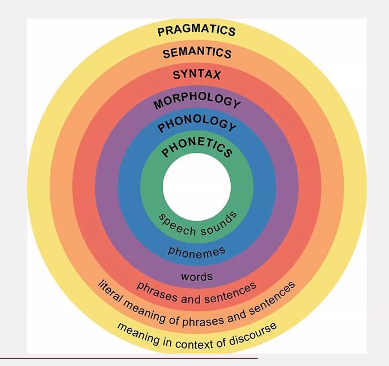

### Advanced Processing

Structural organization of linugistic units
- 
- Phonetics - Study of speech sounds
- Phonology - How sound patterns are organised chornologically and how people perceive them
- Morphology - In linguistics, morphology is the study of words, how they are formed, and their relationship to other words in the same language. 
- Affix : an affix is a morpheme that is attached to a word stem to form a new word or word form
- Syntax : I sthe  most interesting part for a NLP scientist. 
- Semnatics is the meanings. Capturing the meaining of a sentence.
- Pragmatics : Being able to express intent during communcation 

POS Tagging
- 80% of POS tagging would be Symantic and rest would be pragmatic
- English uss 30-40 POS
- NNP : Proper noun
- VBD : Verb in past tense
- CC  : Cordinating conjunction
- VBN : Verb 
- DT  : Determiner
- NN  : Noun
- IN  : Proposition
- JJ  : Adjective
- S   ; Superlative Quantifier
- PRP : Pronoun

One of the main process in compilation is parsing
