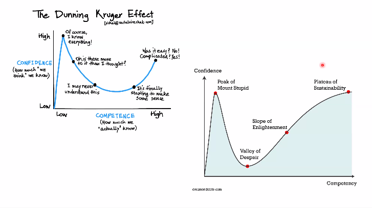

# Natural Language Processing

- Languages of same family can be treated as same when building models
	- Eg : Dravidian Languages, Indo-European Languages

# Changes in NLP Models

##### For undrstanding a sentence or phrase, there a re a few components
- Linguistic knowledge : There are more words than an average person knows
- World Knowledge
- Common Sense reasoning : A sentence is interpreted in right way based on common sense reasoning
- Contextual knowledge is also important
- Socio Cultural norms also plays an important role in interpretation

# Material 
- Jasper.ai formerly known as Jarvis
- 
- 
- Classical NLP Book : Easy to follow references about fundamentals. 

