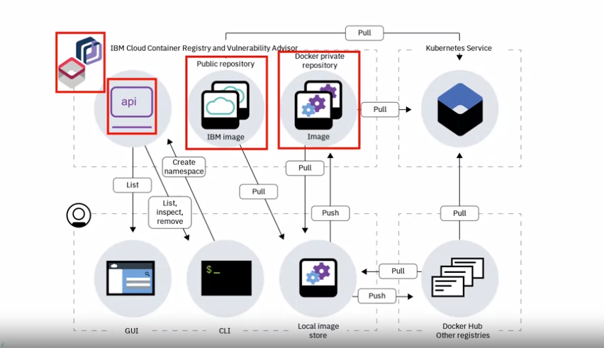

# Container Registries

A place to store and manage container

- Can be public or private
- They can be hosted or self hosted
	- Hosted registries are fully managed by the cloud provider
- Push : Storing an image in a registry
- Pull : Retrieving an image from a registry

# Image naming

Docker build and tag can be used to name images

- Registries store named images
	- Format : hostname/repository:tag
		- Hostname : Registry to which image should be pushed
		- Repository : Group of related container images. Usually different versions of same application or services

		- Tag : Version number or variant details of image
		
	Eg : docker.io/ubuntu:18.04
    	 docker pull ubuntu:18.04
