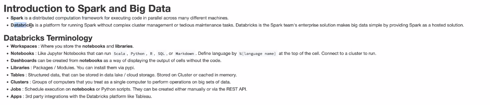

# Databricks and Spark
- <a href='databricks.com/try-databricks'>Try for free </a>

# Intro to Aparche Spark
- Hadoop and Map Reduce were paradigms before Spark
- Spark made it a lot easy to work on these datasets 
- Spark is open source and free
- Databricks is a commercialised version of Spark

- Each spark job is broken down into a number of stages
- Each stage is broken down into a number of tasks
- A stage boundary occurs when data must be exchanged between nodes. This is called a Shuffle. 

# Spark Notebook

<a href='https://github.com/databricks/tech-talks'> Github Notebooks</a>

# Steps
1. Create a cluster
2. Use the stable version and ML version if ML project
3. Select cluster
4. Environment is similiar to Jupyter notebooks
5. 