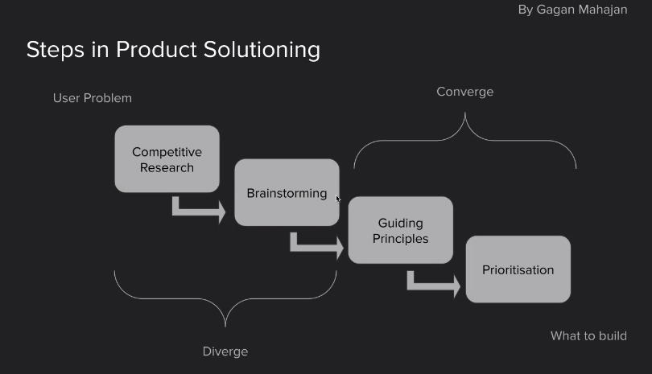

# Gagan Mahajan : Meeting

Two parts in a product management
- Problem discovery
- Solution

- Product manager will be accountable for the outcomes from the product

#### Why do we need to do product solutioning?

- Long Term Vision of company has to be considered

- Things like standardization would be the guiding principles

## Use case
**Problem Statement** : Tier 3 and Tier 4 people are finding it difficult to navigate and the common terms like Cart, Checkout etc

- Brainstorm

- Identify the impact each idea would create in metrics. Use Guestimates

- Execution
- Analytical : Infer insights from user interviews
- Product Skillset
- Are you a hustler?
- Are you able to make an impact?
- Are you able to use the right metrics?
- Communication
- Strategic Thinking
- Tailor your ocntent

Product Analytics : 
- Analysics and Execution
	- Learn from user interview analytics
    - Execution : Solving solution with designers and engineers
   

Reference : Shreyas Doshi
Problems with subscriptions?
