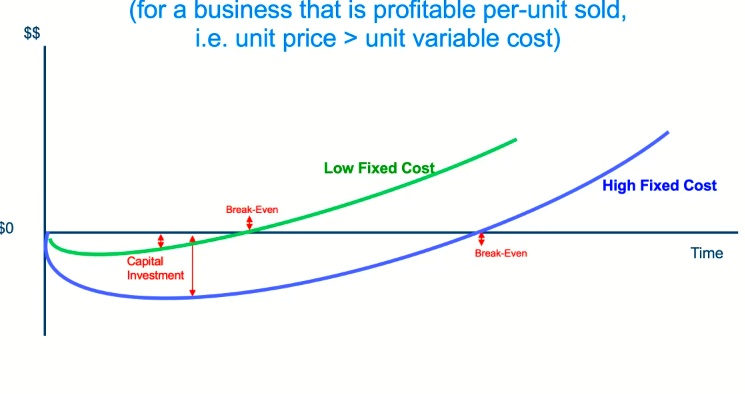
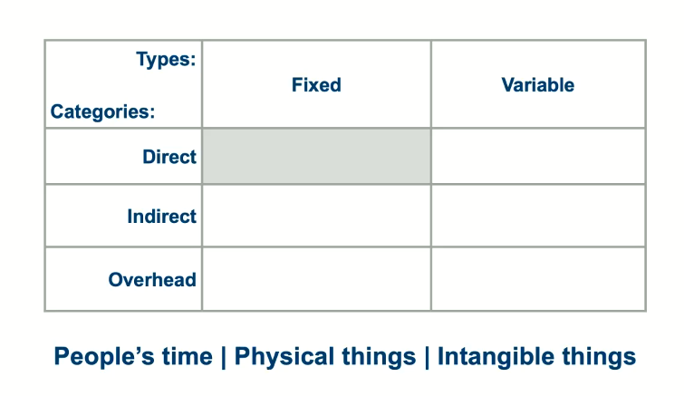

# Money
- It is needed for the survival of our business
- Business does not survive if we do not deliver value
- Hence delivering value is important and hence the cost needed to deliver value

#### Identify the cost to excecute the Business Model
- What are we spending money on?
	- People's time
		 - People may work for equity
	- Physical things
		- Materials, Equipments, Facilities etc
	- Intangible things
		- Regsitrations,Permits, Certifications, Licenses etc

- Basic Types of Cost
	- Fixed costs vs variable
	High fixed costs would imply higher investments, and longer break even. 
    
    - Indirect costs 
    	- Things ou use to make/deliver your product but are not part of it
    - Overhead Costs 
    	- Can be purchases or rentals or leashes
    - Cost Matrix
    
    
    
#### Common Startup Errors

1. Make cost assumptions based on too little data / too little interviews
2. Fail to undrstand unit economics ( What is fixed vs variable)
3. Underestimating starup, marketing and customer acquisition costs and break even points
4. Underestimate ongoing costs to sustain operations

!Idealy money coming in should be greater than expenses

###### Identify and source sources of money that will exceed our uses of money

#### Sources of Money
- REvenue
- Investments
- Grants and Scehemes
- Gifts
- 