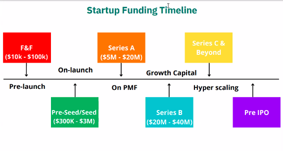

# Funding

Startup fuding timeline

- Bootstrap : Self funded
- Unicorn : When a company reaches 1Billion $ evaluation

Company can run on debt or equity
- Convertible loan : Loan which will convert to equity
- Equity : Common, Preferred , Convertible ,Advisory stock etc
- Ease Off share : Common stock with lesser rights. Vesting is an important concept here
- Founders agreement : If you do not stay for a minimum period, we wil give you shares. Or else it will go back to company

Types of equity
- Funding is given for board seats, affirmation etc

- Angels : People who are willing to invest. 
	- Can be rich people
    - Founders
    - Angels groups can be of help : Around 30 angel groups are in India. Eg: Chennai Angels, Mumbai Angels
- Syndicates : Usually invest 20lakh to 1 crore
- Crowd funding : Kickstarted, ketto
- Platforms : LetsVenture, Angelist
- HNI : Investment of 5cr and above
